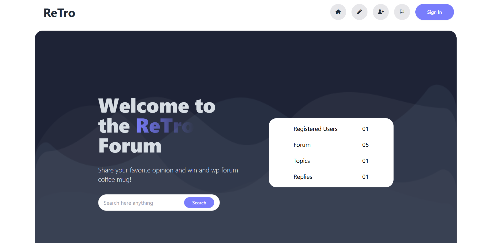

<h1 align="center">
 🏛️ Retro Forum – A Community Discussion Platform
</h2>

  A modern forum-style platform where users can explore, discuss, and connect with communities worldwide.  

  

  
  
  
  
  
  

  

  
  
  
  

  

---

## 🧾 Overview

**Retro Forum** is a dynamic discussion platform built with **HTML, TailwindCSS, DaisyUI, and Vanilla JavaScript**.
It consumes data from the **Programming Hero OpenAPI** and provides an interactive, user-friendly experience to browse, read, and engage with forum posts.

The project emphasizes **UI simplicity, fast loading, and real-time interactivity**.

---
## 📸 Preview

  

---

## ✨ Key Features

### 👥 For All Visitors

* Browse forum posts with author details and activity status
* Search posts by category
* Explore **latest posts** with author profile & publish date
* View post details: title, description, comment count, view count, and time

### 📌 Interactive Features

* **Mark As Read** → Add posts to a separate read list with count tracking
* **Live Counter** → Automatically increments when a post is marked as read
* **Dynamic Filtering** → Search by category in real-time
* **Responsive Design** → Fully responsive across devices (mobile, tablet, desktop)

### 🎨 UI Highlights

* Modern, clean, card-based layout
* Status indicator for users (active / inactive)
* Smooth use of **TailwindCSS** & **DaisyUI components**
* Font Awesome icons for better UX

---

## 🛠️ Tech Stack

* **Frontend**: HTML, CSS, TailwindCSS, DaisyUI, JavaScript
* **API**: Programming Hero OpenAPI (Retro Forum & Latest Posts endpoints)
* **Deployment**: Vercel
